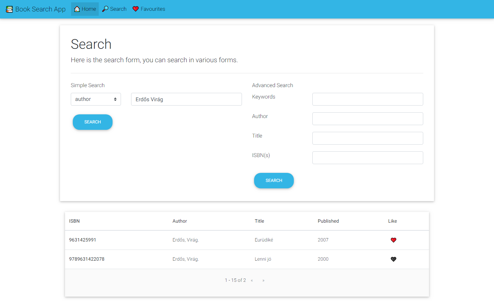

# Book Search Application

This project was made for one of classes homework.

## Preview

## Technologies
The project is created with:
- TypeScript: 3.2.2
- Angular: 7.3.8
- Bootstrap version 4

## Launch
First you should install the packages with `npm install`, then you can run the application, with `ng serve`.
Navigate to `http://localhost:4200/`.
